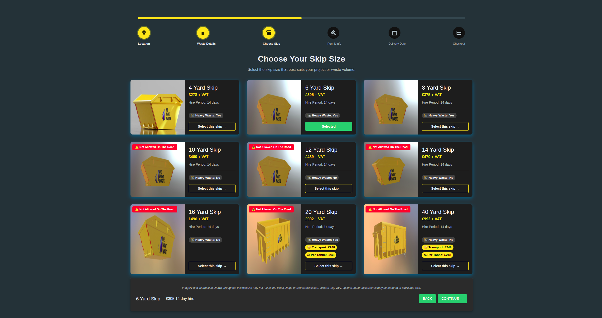
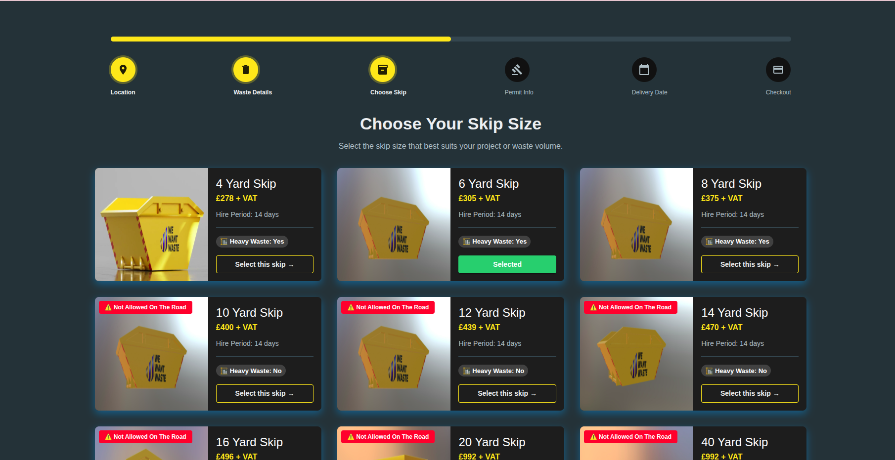
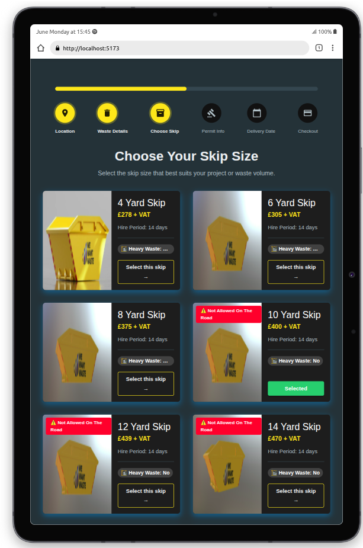
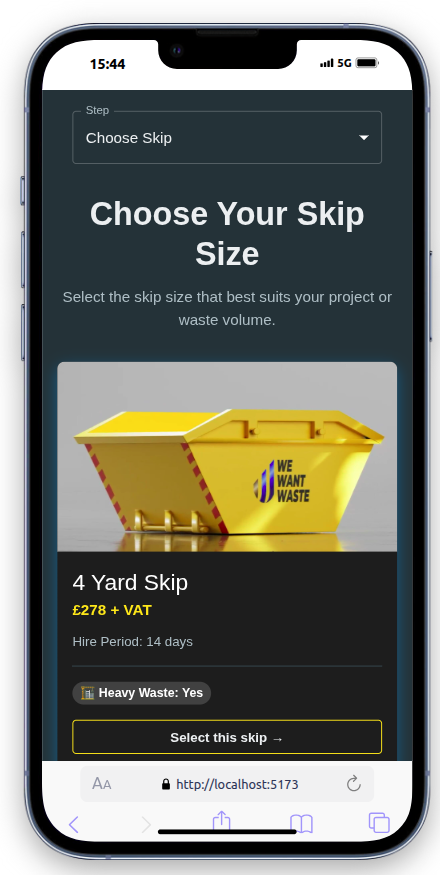

# REM-WASTE

### Built with the tools and technologies:


---

## Table of Contents

- [Overview](#overview)
- [Why Rem-Waste?](#why-rem-waste)
- [Approach](#approach)
- [Getting Started](#getting-started)
  - [Prerequisites](#prerequisites)
  - [Installation](#installation)
  - [Usage](#usage)

---

## Overview

**REM-WASTE** helps users effortlessly choose the most suitable skip for their waste disposal needs. Designed with simplicity and performance in mind, the platform is powered by modern web tools and frameworks.

### Desktop View


### Laptop View


### iPad View


### Phone View



---

## Why Rem-Waste?

This project enhances the skip hire experience through dynamic data fetching and a responsive interface. The core features include:

- 📱 **Responsive Design**: Ensures usability across devices, providing a seamless experience for all users.
- 🌍 **Dynamic Data Fetching**: Fetches skip data based on user location, enhancing relevance and convenience.
- 🛠️ **Clean Architecture**: Promotes maintainability and scalability with well-structured components and services.
- 🎨 **Custom Theming**: Offers a cohesive visual experience with a tailored Material-UI theme.
- 😃 **User-Friendly Interface**: Simplifies the skip selection process with intuitive navigation and clear progress indicators.
- 🔒 **Type Safety**: Implements TypeScript for enhanced code quality and reduced errors, streamlining development.

---
## Approach

This application was designed with user experience and scalability in mind. My approach included:

- Structuring components modularly to keep the codebase maintainable.
- Using Material UI with a custom theme for consistent styling.
- Fetching skip data dynamically via the `getSkipsByLocation` service based on postcode.
- Creating reusable UI components (like `SkipCard` and `ProgressSteps`) to streamline development.
- Optimizing responsiveness using MUI's Grid system and media queries.


## Getting Started


### Prerequisites

Make sure you have the following installed:

- Node.js >= 18.x
- npm 

### Installation

Build REM-WASTE from the source and install dependencies:

```bash
# Clone the repository
git clone https://github.com/Stensis/rem-waste
cd rem-waste

# Install dependencies
npm install 
```

### Usage
To start the development server:
```bash
npm run dev
```